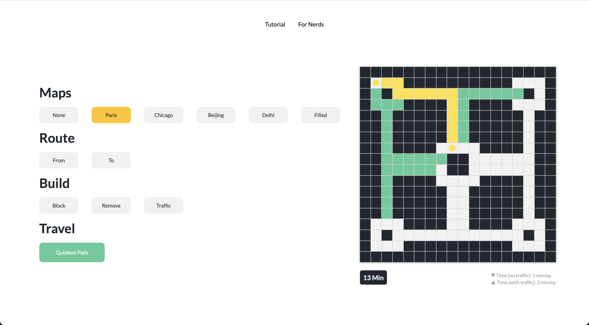

# Navigation Simulator
[Try Me! (Desktop Only)](https://irtizaaah.github.io/navigation_simulator/)

A web app that finds the fastest route to a desired location in a user built maze-map with traffic.

<!-- ABOUT THE PROJECT -->
## About The Project

  
  

### Theory
Every square in this grid is represented by a node in a graph. Every node has an edge with a weight connecting it to it's adjacent nodes. This weight represents the cost of traveling from one node to another.

Since this grid is represented by a graph under the hood, a graph traversal algorithm, like Dijkstra’s algorithm, can find the shortest path to every node. It does so by comparing the cumulative edge weights incurred by travelling every possible path from the starting node to every other node in order to find the path with the smallest cumulative weight. The order in which the algorithm visits these nodes is what is being visualized on the screen when you click ‘Quickest path’.

Here are the costs associated with traveling from square to square in this grid:
1. The cost of traveling to a neighboring/adjacent square is 1 minute.
2. The cost of traveling to a square with traffic is 3 minutes.
3. The cost of traveling to a blocked node is 0 minutes (since it’s not possible).

### Techstack
* [React.js](https://reactjs.org/)
* JavaScript
* CSS
* HTML

<!-- TUTORIAL -->
## Tutorial
This program will find the shortest route (by time) between any two locations in this grid -taking both distance and traffic into consideration. It's a very simplified version of how real navigation services are able to suggest you the fastest routes to your destinations.

### Step 1: Pick a Map
* These "maps" are really just mazes, which you can customize.
* You can either pick pre-built ones based on real cities, or pick "none" or "filled" to build your own from scratch.

### Step 2: Select Your Route
* Decide where you want to start and end your journey.
* You can either click on the "From" and "To" buttons, or directly the points on the grid you want to select.
* After selecting your points, click on the new sqaure you want to place your points.

### Step 3: Build In Additional Items
* Customize your roads by adding and removing blocks, or by inserting traffic/congestion at any spot.
* Click on "block", "remove", or "traffic" depending on which edit mode you want to enter.
* After entering the "traffic" edit mode, click the square you want to insert traffic in.
* After entering "block" or "remove" edit modes, click any square to activate the brush, hover over the desired squares to draw in them, and click any square again to deactivate the brush.

### Step 4: Travel!
* Once you're happy with your map, you can click "Quickest path" to watch the algorithm visually figure out the fastest route to your destination.

